# Fandango ticket watcher — Dockerized watcher + A-List auto-purchase

**Intent:** Run a **single Docker image** on your home PC (portable to a VPS later) that (1) watches Fandango's Universal CityWalk Hollywood pages on a ~5-minute cadence for IMAX / IMAX 70mm / Dolby (Prime) / Laser-at-AMC-Recliners release drops, (2) classifies the release schema, (3) sends simultaneous SMS + email on every meaningful transition, and (4) **races a scripted Playwright purchaser** into Fandango's checkout using your pre-mapped preferred seats per auditorium, applying **AMC Stubs A-List** and **refusing to complete the reservation unless the displayed total is exactly `$0.00`**. An **open-source vision-LLM agent fallback** (browser-use + Qwen2.5-VL or any OpenAI-compatible model) rescues the purchase flow *only* when the scripted selectors break mid-checkout.

**Why this shape:**

- **Deterministic scripted Playwright** is the only path fast enough to win seats on a hype IMAX 70mm drop (5–15 seconds end-to-end vs. 1–3 minutes for a vision-LLM agent).
- **Vision-LLM browser agents excel at rescue**, not racing: when Fandango A/B-tests a button label on release day, the agent can still recognize and click it instead of crashing the whole flow.
- **AMC Stubs A-List makes auto-buy safe** because the economic blast radius of a mistake is near zero — A-List reservations are free to cancel and rebook before showtime — **provided we enforce the `$0.00` invariant** as the only gate to "Complete Reservation."
- **Docker** collapses "home PC now / VPS later" into the same artifact. Named volumes keep the logged-in Fandango + AMC Stubs browser profile, screenshots, and state durable across container rebuilds.

**Environment tooling:** Python 3.13+ managed by **[uv](https://docs.astral.sh/uv/)** *inside* the image (`uv sync`, `uv run …`). The image itself is based on Microsoft's official Playwright Python image so Chromium + system deps are already solved.

---

## High-level architecture

```text
                       ┌─────────────────────────────────────────────────┐
                       │                 Docker image                     │
                       │                                                  │
   Fandango page ◄─────┤  1. Watcher (Playwright, ~5 min poll + jitter)   │
                       │       │ parses page → classifies release_schema  │
                       │       ▼                                          │
                       │     bad → good transition?                       │
                       │       │                                          │
                       │       ├──► Notify (Twilio SMS + SMTP, parallel)  │
                       │       │                                          │
                       │       └──► 2. Purchaser (scripted Playwright)    │
                       │                 │ races to seat map              │
                       │                 │ picks preferred seat per       │
                       │                 │   format → auditorium map      │
                       │                 │ runs $0.00 invariant check     │
                       │                 │                                │
                       │                 ├── success → "Purchased" SMS    │
                       │                 │                                │
                       │                 └── scripted failure mid-flow    │
                       │                         │                        │
                       │                         ▼                        │
                       │      3. Agent fallback (browser-use + VLM)       │
                       │                 vision-driven recovery           │
                       │                 ($0.00 invariant still gates)    │
                       └─────────────────────────────────────────────────┘

  Volumes:  browser-profile/   artifacts/screenshots/   artifacts/purchase-attempts/   state/
  Secrets:  TWILIO_*, SMTP_*, OPENROUTER_API_KEY / OPENAI_API_KEY (agent fallback; pick by base_url)
```

The scripted purchaser handles the common case in ~5–15 seconds at near-zero cost. The agent fallback only fires when Fandango changes markup on release day — exactly when a brittle scripted flow would otherwise fail.

---

## MVP success criteria

- [ ] `docker compose up -d` starts watcher + purchaser on your home PC using a pre-warmed Fandango browser profile.
- [ ] The watcher polls one primary Fandango route and one optional backup route (e.g. `?format=IMAX%2070MM`) every ~5 min with jitter, writing a timestamped screenshot + structured parse result on every crawl.
- [ ] A release-schema classifier (`not_on_sale | partial_release | full_release`) runs every crawl and is the source of truth for "watchable."
- [ ] State machine fires **SMS + email in parallel** only on `bad → good` transition and enqueues one purchase attempt per transition.
- [ ] Purchaser uses a **pre-warmed Fandango browser profile** (one-time headed login, persisted in a Docker named volume) with AMC Stubs linked and CityWalk Hollywood set as the default theater.
- [ ] Purchaser consults a **format → auditorium → seat-priority** map in config and attempts the highest-priority seat available for the matched format.
- [ ] **`$0.00` invariant** is enforced: the "Complete Reservation" button is **never** clicked unless the DOM shows total `$0.00` AND a recognizable A-List/Stubs benefit line on the review page AND the showtime/theater/seats on review match what the watcher enqueued. Any failed check halts the attempt and SMSs the human with a deep link to the review page.
- [ ] If the scripted purchaser fails mid-flow (selector not found, layout drift, popup), a CU fallback is invoked automatically with the same invariant enforced — in Python, not by the model.
- [ ] If the preferred showtime is sold out, the purchaser stops and texts the human (no auto-fallback to alternate showtimes in v1).
- [ ] **Dry-run mode** (`purchase.mode: notify_only`) exercises the full pipeline with the final click stubbed.
- [ ] Screenshots retained for 7 days (`max_age_days: 7`); each purchase attempt writes a labeled screenshot per step to `artifacts/purchase-attempts/<timestamp>/`.
- [ ] The image that runs on your home PC runs unchanged on a VPS.

---

## Scope

**In**

- Docker-first: one image, `docker-compose.yml`, named volumes for `browser-profile/`, `artifacts/`, `state/`; secrets via env or Docker secrets.
- uv-managed Python project inside the image (`pyproject.toml`, `uv sync`, `uv run playwright install chromium` in the build).
- Playwright + Chromium, headless in production, headed for the one-time login.
- **Theater focus:** Universal CityWalk Hollywood AMC (19 auditoriums incl. IMAX 70mm, Dolby, Laser-at-Recliners).
- **Route focus:** canonical movie pages and format-filtered routes (`?format=IMAX%2070MM`).
- **Format focus:** IMAX, IMAX 70mm, Dolby (Prime), Laser at AMC Recliners.
- **Seat preference map** in config per format → auditorium → ordered seat list (your real preferences wired in as defaults).
- **Notifications:** Twilio SMS + SMTP email in parallel on release transition AND on purchase outcomes.
- **Purchaser tier:** scripted Playwright flow clicking detection → seat pick → review → complete, gated by the `$0.00` invariant.
- **Agent fallback:** open-source `browser-use` + a vision LLM invoked only when the scripted flow errors mid-checkout; same `$0.00` invariant, and the agent is explicitly forbidden from clicking the final Complete button itself.
- Persistent Fandango + AMC Stubs session stored in the mounted browser profile volume.
- Structured logging (console + file), screenshot artifacts on every crawl and every purchase step.

**Out**

- No storing of raw credit-card numbers anywhere. A-List reservations are $0; non-$0 upcharges (rare special 70mm events) automatically halt for human review.
- No CAPTCHA defeat, no account takeover, no multi-tenant SaaS.
- No sub-minute polling, no scraping Fandango's full catalog.
- No auto-fallback to alternate showtimes in v1 — human decides on miss.
- No mobile/native AMC app automation.

**Later (post-v1)**

- Configurable alternate-showtime allowlist for auto-retry on miss.
- Additional venues (e.g. AMC Burbank 16) as fallback theaters.
- Twitter/X monitoring of official studio accounts as an *early hint* pipeline (separate module, separate state; Fandango stays authoritative for "can I buy?").
- Telegram / ntfy / Discord notification channels.
- Price-caps branch if A-List ever stops covering a given showing and you want to allow small upcharges.

**Compliance note:** Automated access may conflict with site terms. Run **low volume** and accept that Fandango may change markup or add friction. Prefer official alerts when offered.

---

## Repo layout (target)

```text
fandango_watcher/
  PLAN.md  README.md
  Dockerfile
  docker-compose.yml
  .dockerignore
  .env.example                   # Twilio + SMTP + OPENROUTER_API_KEY / OPENAI_API_KEY
  config.example.yaml            # routes, format policy, seat priority, poll
  pyproject.toml                 # deps (playwright, twilio, pyyaml, pydantic; browser-use as optional extra)
  uv.lock
  artifacts/
    screenshots/                 # gitignored, mounted as volume
    purchase-attempts/           # per-attempt dir of screenshots + json trace
  state/
    state.json                   # last status, last alert, last purchase, error streak
  src/fandango_watcher/
    __init__.py
    models.py                    # Pydantic schemas (+ PurchaseAttempt, SeatPreference)
    watcher.py                   # crawl → classify → maybe notify → maybe enqueue purchase
    detect.py                    # page parse + release_schema classification
    notify.py                    # Twilio + SMTP in parallel with per-channel retry
    state.py                     # load/save state
    config.py                    # pyyaml → validated Pydantic config
    cli.py                       # `watch | once | test-notify | test-purchase | login`
    purchaser/
      __init__.py
      scripted.py                # deterministic Playwright checkout flow
      seats.py                   # seat-priority resolver
      invariants.py              # $0.00 + A-List benefit detection (kill switch)
      agent_fallback.py          # browser-use + VLM wrapper (invoked only on failure)
```

---

## Docker & deployment

**Base image:** `mcr.microsoft.com/playwright/python:v1.48.0-jammy` (or latest stable). Chromium + system deps pre-installed; Python deps layered via uv.

**Named volumes (persist across container rebuilds):**

- `fandango_profile:/app/browser-profile` — Playwright `user_data_dir` with your logged-in Fandango + AMC Stubs session and CityWalk set as default theater.
- `fandango_artifacts:/app/artifacts` — screenshots + purchase-attempt traces.
- `fandango_state:/app/state` — `state.json`.

**First-run flow (one-time):**

1. `docker compose run --rm watcher login` — launches a **headed** Chromium (via X11/RDP on the home PC, or VNC on a VPS). You log into Fandango, link AMC Stubs, confirm CityWalk Hollywood as the default theater, and walk through one real checkout to $0.00 (cancel before committing) so fraud-detection flags clear. Session persists to the volume.
2. `docker compose up -d` — container starts in headless mode using the warmed profile.

**Health:** `/healthz` HTTP endpoint returning last-crawl timestamp, last `release_schema`, last error streak.

**Environment (to go in a rewritten `.env.example` — the current file only contains leftover X/Twitter keys and should be replaced):**

- `TZ=America/Los_Angeles`
- `TWILIO_ACCOUNT_SID`, `TWILIO_AUTH_TOKEN`, `TWILIO_FROM`, `NOTIFY_TO_E164`
- `SMTP_HOST`, `SMTP_PORT`, `SMTP_USER`, `SMTP_PASSWORD`, `SMTP_FROM`, `NOTIFY_TO_EMAIL`
- `OPENROUTER_API_KEY` / `OPENAI_API_KEY` (bearers for the vision LLM; `resolve_llm_api_key_for_agent` in `agent_fallback.py` picks `OPENROUTER_API_KEY` when `agent_fallback.base_url` is OpenRouter, otherwise `OPENAI_API_KEY` first. Set both if you use both providers. Leave both empty for self-hosted vLLM with no auth.)
- `WATCHER_MODE=watch|once|dry-run`

**Home PC → VPS migration:** same image, same compose file, same volumes (either use Docker named volumes end-to-end or back up / restore as tarballs). Expect fraud-detection behavior to differ (residential → data-center IP); plan a one-time headed re-login via VNC on the VPS.

---

## Configuration (example shape)

```yaml
targets:
  - name: odyssey-imax-70mm
    url: https://www.fandango.com/the-odyssey-2026-241283/movie-overview?format=IMAX%2070MM
    wait_until: domcontentloaded
    timeout_ms: 30000
  - name: odyssey-overview
    url: https://www.fandango.com/the-odyssey-2026-241283/movie-overview
    wait_until: domcontentloaded

theater:
  display_name: "AMC Universal CityWalk 19 + IMAX"
  fandango_theater_anchor: "AMC Universal CityWalk"   # substring match in theater-card names

formats:
  require: [IMAX, IMAX_70MM]            # alert AND auto-buy when either becomes bookable
  include: [DOLBY, LASER_RECLINER]      # also auto-buy if these drop

poll:
  min_seconds: 270
  max_seconds: 330
  error_backoff_multiplier: 2
  error_backoff_cap_seconds: 1800

signal:
  page_text_contains_any: ["Get Tickets", "Buy Tickets", "Reserve Seats"]
  require_theater_card_for: "AMC Universal CityWalk"

purchase:
  enabled: true
  mode: full_auto                        # full_auto | hold_and_confirm | notify_only
  invariant:
    require_total_equals: "$0.00"
    require_benefit_phrase_any:
      - "AMC Stubs A-List"
      - "A-List Benefit"
      - "Stubs A-List"
  seat_priority:
    IMAX_70MM:
      auditorium: 19
      seats: [N10, N11, N12, N13, N14, N15, N16, N17]
    IMAX:
      auditorium: 19
      seats: [N10, N11, N12, N13, N14, N15, N16, N17]
    DOLBY:                               # "Prime" at CityWalk
      auditorium: 1
      seats: [E9, E10, E11, E12]
    LASER_RECLINER:
      auditorium: 14
      seats: [H8]                        # balcony row H, seat 8
  on_preferred_sold_out: notify_only     # v1: do not auto-fallback to other seats
  max_quantity: 1

agent_fallback:
  enabled: true
  provider: browser_use                  # browser_use | noop
  model: qwen2.5-vl-72b-instruct         # any chat-completions model id your endpoint serves
  base_url: null                         # e.g. https://openrouter.ai/api/v1 or http://localhost:8000/v1
  invoke_only_on:
    - scripted_selector_failure
    - scripted_step_timeout
  max_steps: 40
  max_cost_usd: 2.00                     # hard per-invocation ceiling

notify:
  channels: [twilio, smtp]
  on_events:
    - release_transition_bad_to_good
    - purchase_succeeded
    - purchase_halted_invariant
    - purchase_halted_preferred_sold_out
    - watcher_stuck_on_error_streak

screenshots:
  dir: /app/artifacts/screenshots
  max_age_days: 7
  per_purchase_dir: /app/artifacts/purchase-attempts

browser:
  headless: true
  user_data_dir: /app/browser-profile
  locale: en-US
  timezone: America/Los_Angeles
  viewport: { width: 1440, height: 900 }
```

`.env` (secrets only) — see list in the **Docker & deployment** section above.

---

## AMC Stubs + the `$0.00` invariant

This is the single most important safety mechanism in the system. The purchaser **MUST NOT** click "Complete Reservation" / "Place Order" unless **every** check below passes, read directly from the review/checkout page DOM by Python (never trusted from a CU model's self-report):

1. The **order total** element's visible text, normalized (case/whitespace-insensitive), equals `$0.00`.
2. **At least one** configured A-List benefit phrase (`"AMC Stubs A-List"`, `"A-List Benefit"`, …) appears in the order-summary region. Extend the allowlist as Fandango's copy changes.
3. The **reserved seat(s)** shown on the review page match the seat(s) the purchaser believed it picked (guard against silent seat reassignment).
4. The **showtime, movie title, and theater** on the review page match the values the watcher enqueued (guard against a nav accident pointing at the wrong showing).

If **any** check fails:

- Do **not** click.
- Screenshot + dump the DOM of the review region to `artifacts/purchase-attempts/<timestamp>/`.
- Send SMS + email with the reason, the current Fandango review URL, and the screenshot attached.
- Let the seat hold expire rather than committing a bad purchase.

The invariant is implemented in `src/fandango_watcher/purchaser/invariants.py` and is called by **both** the scripted purchaser and the CU fallback. The CU fallback is **never** trusted to self-attest the invariant — deterministic Python code re-reads the DOM.

---

## Release schemas (v1 detection model)

Fandango does **not** behave like a simple binary "tickets out" vs "not out" site. There are **three practical schemas** the watcher classifies:

### Schema A — not on sale yet

- Movie-times area effectively unpopulated.
- `Loading calendar` and/or `Loading format filters` may still appear.
- A **FanAlert / Notify Me** form may be the main CTA.
- No real showtime items and no populated theater cards in the movie-times section.
- Example: `The Mandalorian and Grogu` movie-overview while still Notify-Me only.
- Expected watcher result: `release_schema = not_on_sale`, `tickets_live = false`.

### Schema B — partial / early presale release

- Format filters exist and are useful (`IMAX 70MM`, `IMAX`, `70MM`, etc.).
- Only a **small set of theaters** may be populated.
- Only a **small subset of dates/times**, often premium-format-first.
- Real showtime items and at least one theater card exist — tickets **are** live.
- Example: `The Odyssey` `?format=IMAX%2070MM`, `Dune: Part Three` `?format=IMAX%2070MM`.
- Expected: `release_schema = partial_release`, `tickets_live = true`.

### Schema C — broad / normal full release

- Many theater headings present; showtime density much higher than Schema B.
- Standard and premium sections may both exist.
- Example family: broadly released pages once fully populated.
- Expected: `release_schema = full_release`, `tickets_live = true`.

**Important rule:** do **not** use `Know When Tickets Go On Sale` alone as a negative signal. Schema B pages can include that heading elsewhere even when tickets are live. Prefer **positive ticketing evidence**:

- Theater cards in the movie-times section.
- Real showtime items like `7:00p`.
- Buy / check-seat controls.
- Populated format filters tied to actual showtime rows.

**Classification fields:**

```json
{
  "release_schema": "not_on_sale | partial_release | full_release",
  "tickets_live": false,
  "fanalert_present": false,
  "loading_calendar_present": false,
  "format_filters_present": [],
  "theater_count": 0,
  "showtime_count": 0,
  "formats_seen": [],
  "ticket_url": null
}
```

**First-pass heuristic:**

- `not_on_sale`: no theater cards, no real showtime items, FanAlert/Notify Me or loading state dominates.
- `partial_release`: ≥1 theater and ≥1 showtime, counts relatively low and often format-specific.
- `full_release`: many theaters and many showtimes across the movie-times section.

---

## Data models (Pydantic v2, Zod-mirrorable)

Because the implementation is Python + uv + Playwright, **Pydantic v2** is the Zod equivalent: typed models, runtime validation, discriminated unions, clean JSON serialization. If a TypeScript companion app appears later, the shapes mirror to Zod nearly 1:1.

### Shared enums / primitives

- `ReleaseSchema`: `not_on_sale | partial_release | full_release`
- `FormatTag`: `IMAX | IMAX_70MM | SEVENTY_MM | DOLBY | LASER_RECLINER | STANDARD | OTHER`
- `WatchStatus`: `watchable | not_watchable | unknown`
- `PurchaseOutcome`: `purchased | halted_invariant | halted_sold_out | halted_session | failed`

### Shared crawl context

`url`, `page_title`, `movie_title`, `theater_zip`, `crawled_at`, `screenshot_path`, `loading_calendar_present`, `fanalert_present`, `notify_me_present`, `format_filters_present`, `ticket_url`.

### Shared parsed counts

`theater_count`, `showtime_count`, `formats_seen`, `citywalk_present`, `citywalk_showtime_count`, `citywalk_formats_seen`.

### Schema-specific models (discriminated on `release_schema`)

- **`NotOnSalePageData`** — `release_schema = not_on_sale`; expects zero showtimes/theaters; usually `fanalert_present = true`.
- **`PartialReleasePageData`** — `release_schema = partial_release`; `showtime_count > 0`, `theater_count > 0`; preserves fine-grained lists for premium formats and CityWalk matches.
- **`FullReleasePageData`** — `release_schema = full_release`; dense coverage; preserves broader showtime lists and standard-vs-premium sections.

### Nested submodels

- `FormatFilter` — `label`, `normalized_format`, `selected`
- `Showtime` — `label` (e.g. `7:00p`), `ticket_url`, `is_buyable`, `is_citywalk`, `date_label`
- `FormatSection` — `label`, `normalized_format`, `attributes`, `showtimes`
- `TheaterListing` — `name`, `address`, `distance_miles`, `is_citywalk`, `format_sections`

### Purchase-tier models (new)

- **`SeatPreference`** — `format: FormatTag`, `auditorium: int`, `seats: list[str]` (priority order)
- **`PurchaseAttempt`**
  - `attempt_id`, `enqueued_at`
  - `target_name`, `movie_title`
  - `intended_format`, `intended_auditorium`, `intended_showtime`, `intended_seats`
  - `actual_seats_reviewed` (read from review page, for invariant guard)
  - `scripted_path_outcome`: `not_attempted | succeeded | failed_timeout | failed_selector | failed_invariant`
  - `cu_fallback_outcome`: `not_attempted | succeeded | failed_timeout | failed_invariant | failed_budget`
  - `final_outcome: PurchaseOutcome`
  - `total_shown`, `benefit_phrases_detected: list[str]`
  - `screenshots_dir`, `notes`

### Top-level parse result

```json
{
  "release_schema": "partial_release",
  "watch_status": "watchable",
  "url": "https://www.fandango.com/...",
  "movie_title": "The Odyssey (2026)",
  "theater_count": 3,
  "showtime_count": 6,
  "citywalk_present": true,
  "citywalk_showtime_count": 2,
  "formats_seen": ["IMAX_70MM"],
  "ticket_url": "https://www.fandango.com/...",
  "theaters": []
}
```

### Validation philosophy

- **Forgiving** on optional fields (Fandango markup drifts).
- **Strict** on fields the logic truly depends on: `release_schema`, `theater_count`, `showtime_count`, `formats_seen`, `citywalk_present`, `ticket_url`, and (for purchases) the invariant's `total_shown` + `benefit_phrases_detected`.

---

## State machine

```mermaid
stateDiagram-v2
  direction LR
  unknown: Unknown
  bad: NotOnSale
  good: OnSale
  buying: Purchasing
  held: AwaitingConfirm
  bought: Purchased
  halted: HaltedForHuman

  unknown --> bad: first_read_negative
  unknown --> good: first_read_positive
  bad --> good: bad_to_good_alert (SMS + email; enqueue purchase)
  good --> buying: purchaser_starts
  buying --> bought: invariant_ok && complete_click_succeeded
  buying --> held: mode=hold_and_confirm && review_reached
  held --> bought: human_confirms
  held --> halted: human_timeout
  buying --> halted: invariant_failed || preferred_sold_out || scripted_and_cu_failed
  bought --> good: keep watching (refund / schedule-change windows)
  halted --> unknown: manual CLI reset
  good --> bad: optional_regression_log_only
```



**Default policy:** Alert `bad → good` only; log regressions without re-SMSing. Purchase state transitions each generate their own notification events.

---

## Purchase flow (scripted path)

**Target budget:** detection → seat hold ≤ 15s; hold → confirmation page ≤ 10s.

1. Watcher writes a `PurchaseAttempt` with `intended_*` fields from the parsed detection result.
2. Purchaser opens a fresh page in the shared browser context (warmed profile = live session cookies, A-List linked, CityWalk default).
3. Navigates to the target URL; resolves the showtime button for the highest-priority format matching `formats.require ∪ formats.include`.
4. Clicks into the Fandango seat map.
5. Reads the seat map's available-seat state (DOM attributes / data-attrs).
6. Picks the first available seat from `seat_priority[format]`.
7. Proceeds to review. Re-reads movie / theater / showtime / seat; runs the `$0.00` invariant.
8. **Invariant passes:** click Complete. Re-read the confirmation page. Write success screenshots + "Purchased" SMS.
9. **Invariant fails OR any step errors:** attempt scripted retry once (refresh seat map); still broken → escalate to agent fallback.

---

## Agent fallback (browser-use + open-source VLM)

- Invoked **only** when the scripted flow fails inside an already-open purchase flow. Never runs the polling loop. Never starts a purchase from scratch if scripted didn't at least navigate partway.
- Driven by [browser-use](https://github.com/browser-use/browser-use) talking to any OpenAI-compatible chat-completions endpoint — Qwen2.5-VL via self-hosted vLLM, OpenRouter, Together AI, Fireworks, etc.
- Given a tight task prompt containing:
  - The `intended_*` targets (movie, format, showtime, seat priority list).
  - **Hard rule that the agent must never click Complete Reservation / Place Order / Confirm Purchase itself.** It stops at the review page; the scripted purchaser re-validates the invariant and owns the final click.
  - Hard instructions to stop and hand control back on CAPTCHA, 3DS, password re-prompt, or any popup requesting data it wasn't given.
- Enforced hard budgets: `agent_fallback.max_steps` and `agent_fallback.max_cost_usd`. Exceed → halt.
- Returns a structured outcome (`succeeded | failed | needs_human | budget_exhausted | disabled`) to the scripted purchaser, which then re-runs the invariant **in Python** before allowing any "Complete" click.
- Typical cost: depends on endpoint. ~$0 on a self-hosted vLLM; ~$0.10–$0.50 per 30-step rescue on Together / Fireworks at Qwen2.5-VL-72B pricing — acceptable on a release day, unacceptable as the polling mechanism.

---

## Anti-block & reliability practices

| Practice | Why |
|---|---|
| ~5-min intervals + jitter (tunable) | Balance freshness vs hammering; backoff when errors spike |
| Single browser context, sequential targets | Reduce parallel load |
| Reuse `user_data_dir` via named volume | Preserve cookies, A-List link, default theater |
| Headed-mode toggle for first run | Some sites behave differently headless |
| Backoff on consecutive failures (2× up to 30 min cap) | Survive transient blocks / outages |
| Screenshot every crawl and every purchase step | Audit trail for markup changes and seat-race post-mortems |
| Short page timeouts + clear error logs | Fail fast; last visible state still captured |
| Scripted-first, agent-fallback | Scripted wins races; VLM agent fixes drift; cheapest split |
| `$0.00` invariant as deterministic Python | No model can convince us to buy a non-free item |

**Optional later:** Playwright "stealth" or patched Chromium only if consistent headless detection appears — avoid dependency creep for MVP.

---

## Error handling (MVP bar)

- **Watcher nav timeout / 403 / empty DOM:** increment `error_streak`, log, backoff; no purchase enqueue; optional "watcher stuck" alert after N consecutive failures.
- **Selector not found during crawl:** treat as "signal = false" or "unknown" explicitly — document the choice per signal type.
- **Notification send failure:** per-channel retry with small limit; persist per-channel pending flag so a transition is not lost if one provider is down.
- **Purchase enqueued but session expired:** notify "session expired," do not attempt; require `docker compose run login` to re-warm.
- **Scripted step timeout or selector miss:** one retry, then agent fallback.
- **Agent fallback budget exhausted:** halt; SMS + email with the review URL; no auto-retry.
- **Invariant failure at review:** halt permanently for that attempt; manual reset to try again (avoids loops where we keep clicking into a broken review).
- **Confirmation-page parse failure after an apparent success click:** treat as "purchase outcome unknown" — loud SMS + email with screenshot; do not auto-retry (prevents double-purchase).

---

## Cost & latency budget

| Component | Steady-state cost | Per-drop cost | Latency |
|---|---|---|---|
| Watcher polling (Playwright only) | ~$0 (electricity) | — | — |
| Notifications (Twilio SMS + SMTP) | ~$0.01 per drop | — | seconds |
| Scripted purchaser | ~$0 | ~$0 | 5–15s |
| Agent fallback (rare) | $0 most days | $0–$0.50 per rescue (depends on endpoint) | 30–180s |
| Endpoint hard cap | — | `max_cost_usd: 2.00` | — |

Expected pattern: scripted purchaser handles the common case for months at near-zero cost; the agent fires only when Fandango redesigns a page or A/B-tests a button — exactly when scripted selectors break.

---

## VPS migration (later, now trivial)

Not required for v1 (home PC). Docker makes the migration a matter of moving volumes:

- Same image, same compose file.
- Back up `fandango_profile` / `fandango_state` as tarballs; restore on the VPS.
- Expect fraud-detection friction on the new IP; do a one-time headed re-login via VNC.
- Keep the theater URL venue-specific so geo does not silently switch CityWalk to another AMC.
- Use `Restart=unless-stopped` in compose (or systemd wrapping docker compose) for always-on behavior.

---

## Phased checklist

### Phase 1 — Source validation + Docker skeleton

- [ ] Verify Fandango surfaces AMC Stubs A-List benefits consistently on IMAX 70mm / Dolby / Laser-Recliner checkouts at CityWalk Hollywood (capture one $0.00 review screenshot per format as invariant fixtures).
- [ ] Add `Dockerfile` on `mcr.microsoft.com/playwright/python` base; add `docker-compose.yml` with named volumes for profile / artifacts / state.
- [ ] **Replace `.env.example`** (currently leftover X/Twitter keys only) with Twilio + SMTP + `OPENROUTER_API_KEY` / `OPENAI_API_KEY` placeholders.
- [ ] Add `config.example.yaml` matching the structure above (seat priority per format wired to your real preferences).
- [ ] Lock the first watched route and the positive-ticketing rule for CityWalk.

### Phase 2 — Watcher & classifier (detection only, no purchase)

- [ ] Scaffold uv deps (Playwright, Pydantic already present, pyyaml, twilio; browser-use as optional `[agent]` extra) and `uv run playwright install chromium` in the image build.
- [ ] Implement `watcher.py` + `detect.py` using existing Pydantic models; classify Schema A/B/C on real pages.
- [ ] Add `--once` CLI subcommand; write screenshot + parse JSON each run.
- [ ] Add `state.py` so restarts do not re-alert.
- [ ] Add poll loop with jitter + conservative error backoff; prune screenshots by `max_age_days: 7`.
- [ ] Run overnight in `notify_only` mode to measure selector drift and error rates.

### Phase 2.5 — Social signals: X / Twitter (advisory only)

Goal: surface "tickets soon" hints from official movie/studio X accounts
**before or alongside** Fandango's own state changes — without ever blocking
or replacing the Fandango watcher as the source of truth for "can I buy?".

- [x] Add `social_x` block to `config.py` (`SocialXConfig`, `SocialXHandleConfig`) and `config.example.yaml` (disabled by default).
- [x] Add `X_API_KEY`, `X_API_KEY_SECRET`, `X_BEARER_TOKEN` (+ optional access tokens) to `Settings` / `.env.example`.
- [x] Implement `src/fandango_watcher/social_x.py`:
  - `XClient` (httpx + Bearer) wrapping `users/by/username` + `users/:id/tweets`.
  - `match_tweet` pure substring matcher with case-insensitive dedupe.
  - `check_x_signals` orchestrator with per-handle error isolation.
  - `state/social_x.json` persistence (resolved user_id + last_seen_tweet_id per handle).
- [x] Add `Event.SOCIAL_X_MATCH = "social_x_match"`.
- [x] Wire `_maybe_poll_social_x` into the watch loop on its own jittered
  cadence (`social_x.{min,max}_seconds`, default 15-20 min). Failures are
  swallowed so they cannot interfere with Fandango polling.
- [x] Build a clearly-labeled "X HINT" notification message distinct from
  the hard `release_transition_bad_to_good` alert.
- [x] Add `fandango-watcher x-poll` CLI subcommand for one-shot debugging.
- [x] Add `social_x_match` to `notify.on_events` in `config.example.yaml`
  so flipping `social_x.enabled: true` is a one-line activation.
- [x] **Movie ↔ X-handle registry**: top-level `movies:` config block ties
  each movie to its Fandango target(s) AND its X handles + keywords; the
  poller auto-expands movies into the X-handle list and labels every
  match with the movie title + Fandango deep-link.
- [x] Per-handle API-call dedupe: a handle shared by N movies (e.g.
  `@IMAX` watched by both Odyssey and Dune Part Three) hits X exactly
  once per poll, then emits one match per movie context.
- [x] `fandango-watcher movies` CLI subcommand prints the registry for
  pre-flight verification (no network access).
- [ ] Validate against a live handle (e.g. `@IMAX` or `@TheOdysseyFilm`)
  with real bearer token; capture rate-limit headroom on a 15 min cadence.

### Phase 3 — Notifications

- [ ] Implement `notify.py` with parallel Twilio + SMTP and per-channel retry / persisted pending flags.
- [ ] Wire transition-only alerts on `bad → good`.
- [ ] Add `test-notify` CLI to exercise both channels on demand.

### Phase 4 — Scripted purchaser (behind a dry-run flag)

- [ ] Implement `purchaser/scripted.py` end-to-end but keep `purchase.mode: notify_only` until validated.
- [ ] Implement `purchaser/seats.py` resolver consuming the format → auditorium → seats map.
- [ ] Implement `purchaser/invariants.py` with the `$0.00` + A-List benefit check; unit-test against captured review-page HTML fixtures.
- [ ] Add `test-purchase --stub` CLI that runs the whole flow but never clicks "Complete."
- [ ] Capture golden review-page screenshots during a real (manually triggered) run; commit as invariant fixtures.

### Phase 5 — Full auto-buy (flip the default)

- [ ] Set `purchase.mode: full_auto` in the example config; verify on the next real drop or a harmless live test booking you plan to cancel.
- [ ] Cover error paths: session expired, preferred seat lost mid-flow, review page missing benefit phrase, invariant mismatch.
- [ ] Wire purchase-outcome notifications (`purchase_succeeded`, `purchase_halted_invariant`, `purchase_halted_preferred_sold_out`).

### Phase 6 — Agent fallback (vision-LLM rescue)

Goal: when the scripted purchaser breaks mid-checkout (selector miss,
layout drift, surprise modal), a vision-LLM browser agent navigates the
already-open Playwright page back to a usable review state. The Python
`$0.00` invariant in `purchase.py` always re-runs after rescue and
remains the **sole** gate on the final "Complete Reservation" click.
**No agent ever attests the invariant itself.**

- [x] Provider-agnostic abstraction in `src/fandango_watcher/agent_fallback.py`:
  `AgentFallback` Protocol, `RescueRequest` / `RescueResult`,
  `FallbackOutcome` enum, `build_agent_fallback()` factory, `NoopFallback`.
- [x] Default provider = open-source `browser_use` (browser-use library
  driving any OpenAI-compatible vision LLM — Qwen2.5-VL via self-hosted
  vLLM, OpenRouter, Together AI, Fireworks, or OpenAI proper).
  Lazy-imports `browser_use` so the dep stays optional
  (`uv sync --extra agent`); missing dep returns clean `FAILED` with hint
  instead of crashing the watch loop.
- [x] Hard safety rules baked into the task prompt: never click
  Complete/Place Order/Confirm, never enter payment data, escalate on
  CAPTCHA / 3DS / password re-prompt, never substitute alternate seats.
- [x] Config: `agent_fallback.{provider, model, base_url, max_steps,
  max_cost_usd, invoke_only_on}` + `OPENROUTER_API_KEY` / `OPENAI_API_KEY` env vars.
- [x] Wire `build_agent_fallback(...).rescue(page, ...)` into
  `run_scripted_purchase` on **Complete-button miss** (invariant already
  passed): re-extract review DOM, re-validate `$0.00` invariant in Python,
  retry scripted Complete once. ``invoke_only_on`` empty → default
  reasons ``scripted_selector_failure`` + ``scripted_step_timeout`` (the
  latter reserved for future broader rescue). Broad Playwright exceptions
  **outside** this path still return ``FAILED_SCRIPTED`` without rescue
  (safe until a retry envelope exists). Watch loop passes ``settings`` +
  ``cfg.agent_fallback``. Audit fields on ``PurchaseAttempt``:
  ``agent_rescue_attempted``, ``agent_rescue_outcome``, ``agent_rescue_notes``.
  Stubbed flow: ``tests/test_purchaser_rescue.py``.
- [ ] Enforce `max_cost_usd` (current `max_steps` is enforced by
  browser-use; cost accounting needs a per-provider token-usage hook).
- [ ] Calibrate rescue prompt + optional rescue-on-exception against a
  real Fandango failure fixture (see ``dump-review`` + ``review_pages/``).
- [ ] Confirm the Python invariant still gates the final click
  regardless of what the model attempts (golden test with a
  fixture-based `Page` stub that the agent "succeeds" on but whose DOM
  shows `$5.99` — must halt).

### Phase 7 — Hardening & VPS readiness

- [ ] Write `README.md` with `docker compose` commands, the first-run headed-login flow, config + `.env` setup, and troubleshooting.
- [ ] Document how to re-warm the profile volume after an AMC Stubs logout or session expiry.
- [ ] Smoke-test the same image on a VPS (VNC for the one-time login) to prove portability.
- [ ] Record known risks (Fandango markup drift, fraud-detection friction, A-List policy changes on premium formats).

---

## Field notes (real drops & UI behavior)

Observed around **The Mandalorian and Grogu** (Fandango / IMAX context; confirm
timezone vs. your machine — likely Pacific if tied to CityWalk Hollywood).

**On-sale window**

- Tickets actually became purchasable in a **narrow morning window**, roughly
  **6:00–6:30 AM** (same calendar day as the drop).

**External signals (email), same morning**

- **6:10 AM** — email from `fandango@movies.fandango.com` (Fandango).
- **6:30 AM** — email from `noreply@imax.com` (IMAX partner blast).

These are useful **correlates** for human triage or a future optional inbox
watcher; they must **not** replace DOM-based truth in this repo (Fandango can
email before/after the exact moment CityWalk cards flip).

**Pre-sale UI trap (day before)**

- **All day the prior day:** showtimes **appeared** in the UI, but choosing a
  time only surfaced **"Coming soon"** (no real booking path).
- **Implication for detection:** "has showtime labels" is weaker than "can
  reach a bookable seat map / checkout." Our three-schema model should treat
  this as a risk case: either extend parsing to detect **coming-soon / blocked
  click** states, or tighten `partial_release` / `full_release` criteria so we
  do not treat placeholder listings as `watchable` until the click path proves
  bookable. Logged here for Phase 2 classifier calibration and Phase 3
  notification gating.

---

## Open questions

1. **A-List coverage proof per format:** capture one real $0.00 Fandango review screenshot for IMAX 70mm, Dolby (Prime), and Laser-at-Recliner at CityWalk so the `require_benefit_phrase_any` list is grounded in actual copy rather than guesses.
2. **Special-event 70mm exclusions:** some one-off 70mm event screenings historically fall outside A-List's no-upcharge policy. The invariant will correctly halt on those — confirm "halt on any non-$0 total, always, even for covered formats" is the desired behavior rather than a configurable upcharge ceiling.
3. **Initial VPS posture (only if/when migrating):** will the VPS use a residential proxy for checkout or a direct data-center IP? The architecture supports either, but the choice changes the first-run friction.

---

## Social signals (Twitter / X) — implemented in Phase 2.5

**Status:** Shipped (see Phase 2.5 checklist above).

**Shape:**

- Module: `src/fandango_watcher/social_x.py`. Read-only X API v2 via Bearer.
- Config: `social_x:` block in `config.yaml` (disabled by default).
- State: `state/social_x.json` (separate from per-target Fandango state).
- Cadence: own jittered interval (`social_x.{min,max}_seconds`, default ~15 min).
- Event: `social_x_match`. Notifications are explicitly labeled "X HINT" so
  no reader can confuse them with a hard `release_transition_bad_to_good`.
- Isolation: any X poll failure is logged and swallowed — Fandango polling
  is never blocked or delayed by X API issues.
- CLI: `fandango-watcher x-poll` for one-shot debugging.

**Operational notes:**

- Bearer token only. OAuth1 user-context tokens (`X_ACCESS_TOKEN`,
  `X_ACCESS_TOKEN_SECRET`) are reserved for a future posting flow; the
  read-only poller does not need them.
- X API v2 free / basic tier is rate-limited per 15 min; the default
  ~15-20 min jittered cadence keeps a small handle list comfortably inside
  read budgets. Increase `social_x.min_seconds` if you add many handles.
- `since_id` is persisted per handle so polls are incremental — steady
  state with no new tweets = a single empty-data response per handle.

---

## References

- uv: https://docs.astral.sh/uv/
- Playwright Python: https://playwright.dev/python/
- Playwright Docker images: https://mcr.microsoft.com/en-us/product/playwright/python
- Twilio SMS API: https://www.twilio.com/docs/sms
- browser-use: https://github.com/browser-use/browser-use
- Qwen2.5-VL: https://github.com/QwenLM/Qwen2.5-VL
- Fabric Origin / Fandango partner APIs: only if pursuing a commercial integration
